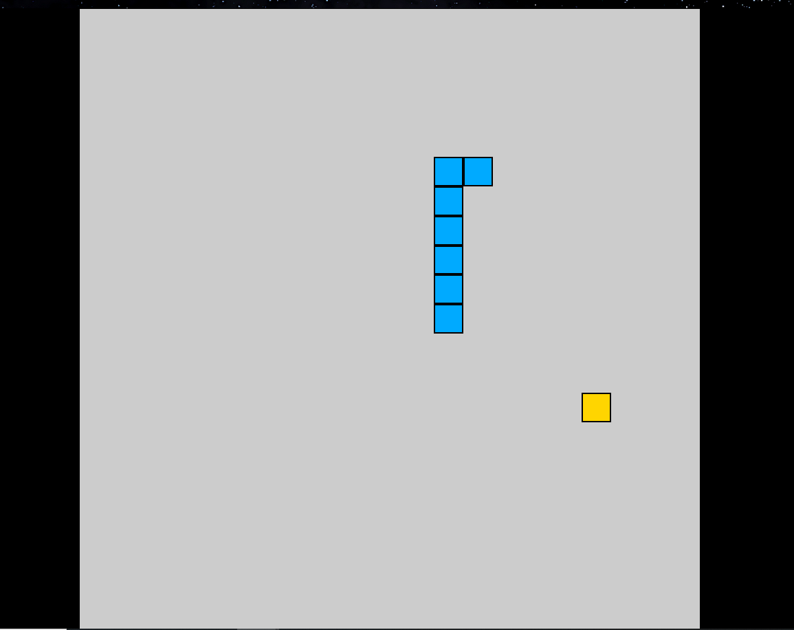
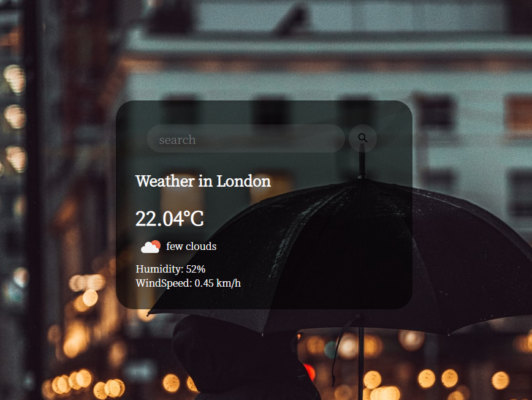

# JsPractice

[star]:★
[half-star]:☆

| :card_index: | :jack_o_lantern: | :beer: | :fish_cake: | :octocat: |
| ----- | ----- | ----- | ----- | ----- |
| [clock](#clock):☆ | [GreedySnake](#GreedySnake):★☆ | [TicTacToe](#TicTacToe):★ | [calculator](#calculator):★ | [WeatherApp](#WeatherApp):★☆ |

---
<span id="clock"></span>
## [clock](./content/clock/) : ☆
### 知识点:
- 1、html自定义属性`data-name=value`,以`data-`开头
```html
<div class="hand hour" data-hour-hand></div>
```
- 2、css自定义变量`--name:value`,以`--`开头
```css
.clock .number {
    /* css自定义变量：--name:value */
    --rotation: 0;
    position: absolute;
    width: 100%;
    height: 100%;
    text-align: center;
    /* 使用var引用变量 */
    transform: rotate(var(--rotation));
    font-size: 1.5rem;
}
```

### 运行效果

### [video](https://www.youtube.com/watch?v=Ki0XXrlKlHY)

---
<span id="GreedySnake"></span>
## [GreedySnake](./content/GreedySnake/) : ★☆
### 知识点:
- 1、grid布局
```css
#game-board {
    background-color: #ccc;
    width: 100vmin;
    height: 100vmin;
    display: grid;
    /* 定义大小为21*21 */
    grid-template-columns: repeat(21, 1fr);
    grid-template-rows: repeat(21, 1fr);
}
```

### 运行效果

### [video](https://www.youtube.com/watch?v=QTcIXok9wNY)

---
<span id="TicTacToe"></span>
## [TicTacToe](./content/TicTacToe/) : ★
### 知识点:
- 1、::after与::before以及not选择器的使用
```css
.cell.x::before,
.cell.x::after,
/* 不是x类也不是circle类才会应用此属性 */
.board.x .cell:not(.x):not(.circle):hover::before,
.board.x .cell:not(.x):not(.circle):hover::after {
    content: "";
    position: absolute;
    width: calc(var(--mark-size) * .15);
    height: var(--mark-size);
}
```

### 运行效果


### [video](https://www.youtube.com/watch?v=Y-GkMjUZsmM)

---
<span id="calculator"></span>
## [calculator](./content/calculator/) : ★
一个简易计算器
### 运行效果


### [video](https://www.youtube.com/watch?v=j59qQ7YWLxw)

---
<span id="WeatherApp"></span>
# [WeatherApp](./content/WeatherApp/) : ★☆
## 知识点:
- api的使用
```js
fetchWeather(city) {
    fetch(`http://api.openweathermap.org/data/2.5/weather?q=${city}&appid=${this.key}&units=metric`)
    .then(response => response.json())
    .then(data => this.displayWeather(data))
}

```

## API
[获取天气](https://openweathermap.org/current)
[获取天气图片](https://openweathermap.org/img/wn/04d.png)
**具体使用见代码line17 line29**

## 运行效果


## [video](https://www.youtube.com/watch?v=WZNG8UomjSI)