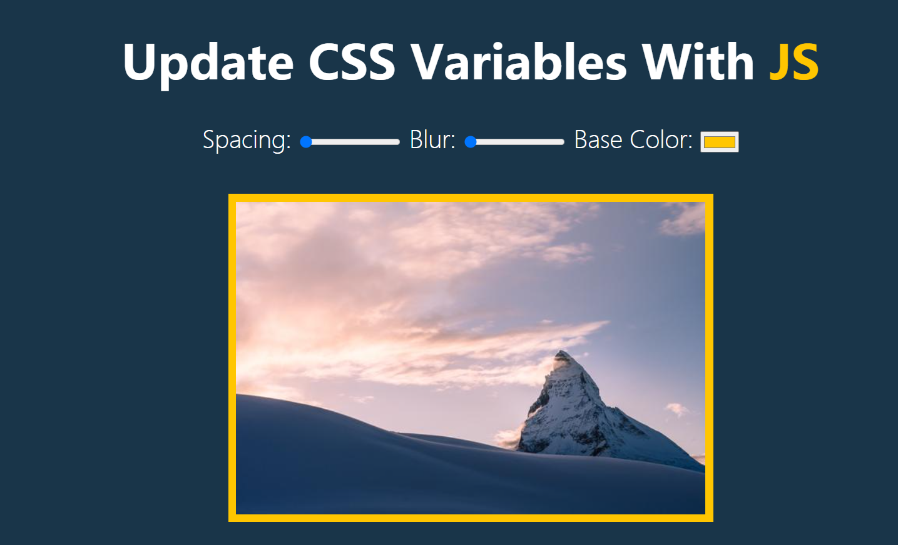

# [JavaScript30](./content/JavaScript30/) : ★☆
实现了部分JavaScript30上的代码
## 知识点:
- audio标签
```html
<audio src="./sounds/tink.wav" data-key="76"></audio>
```
- classList.toggole
```js
const panels = document.querySelectorAll('.panel')
panels.forEach(panel => panel.addEventListener('click', e=>{
    // toggle:The toggle() method of the DOMTokenList interface 
    // removes a given token from the list and returns false. 
    // If token doesn't exist it's added and the function returns true.
    panel.classList.toggle('open')
}))
```
- js修改css变量
```js
const suffix = this.dataset.sizing || ''
document.documentElement.style.setProperty(`--${this.name}`, this.value + suffix)
```

## 运行效果

### <a href="https://inthe-darkness.github.io/JsPractice/content/JavaScript30/DrumKit/">DrumKit</a>

### <a href="https://inthe-darkness.github.io/JsPractice/content/JavaScript30/FlexPanelsImageGallery/">FlexPanelsImageGallery</a>

### <a href="https://inthe-darkness.github.io/JsPractice/content/JavaScript30/UpdateCssVariableWithJS/">UpdateCssVariableWithJS</a>


## [video](https://javascript30.com/) [github](https://github.com/wesbos/JavaScript30)