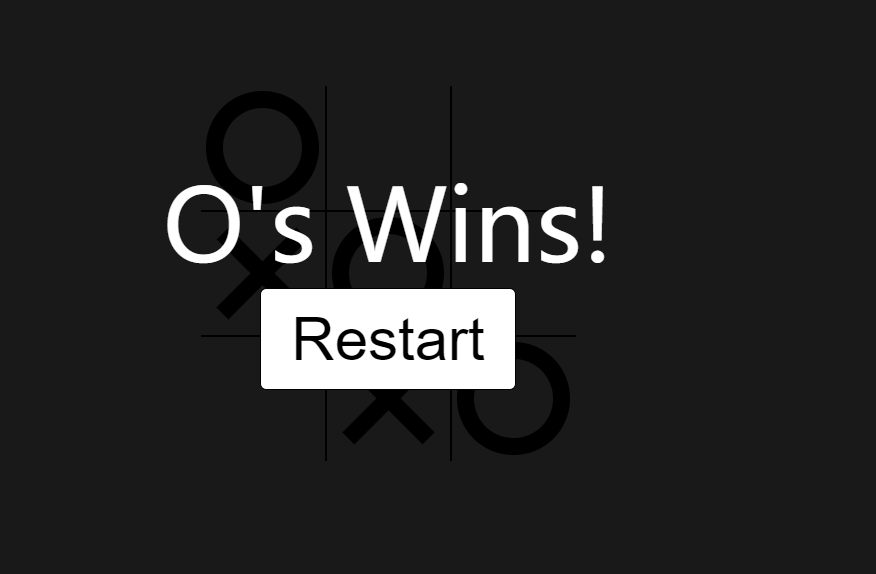

# <a href="https://inthe-darkness.github.io/JsPractice/content/TicTacToe/">TicTacToe</a> : ★
## 知识点:
- 1、::after与::before以及not选择器的使用
```css
.cell.x::before,
.cell.x::after,
/* 不是x类也不是circle类才会应用此属性 */
.board.x .cell:not(.x):not(.circle):hover::before,
.board.x .cell:not(.x):not(.circle):hover::after {
    content: "";
    position: absolute;
    width: calc(var(--mark-size) * .15);
    height: var(--mark-size);
}
```

## 运行效果



## [video](https://www.youtube.com/watch?v=Y-GkMjUZsmM)