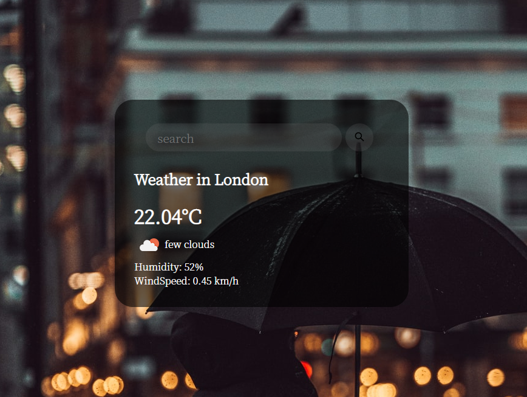

# WeatherApp : ★☆
## 知识点:
- api的使用
```js
fetchWeather(city) {
    fetch(`http://api.openweathermap.org/data/2.5/weather?q=${city}&appid=${this.key}&units=metric`)
    .then(response => response.json())
    .then(data => this.displayWeather(data))
}

```

## API
[获取天气](https://openweathermap.org/current)
[获取天气图片](https://openweathermap.org/img/wn/04d.png)
**具体使用见代码line17 line29**

## 运行效果


## [video](https://www.youtube.com/watch?v=WZNG8UomjSI)